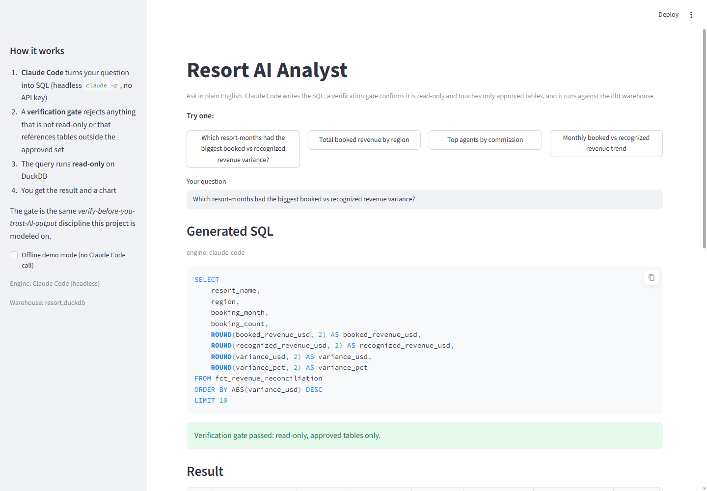
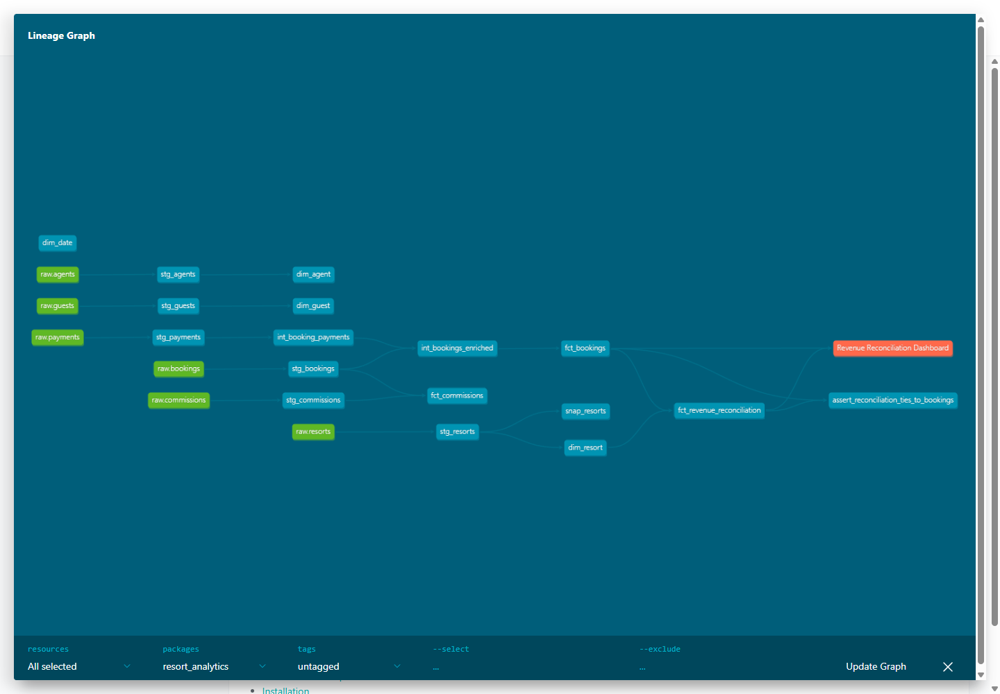
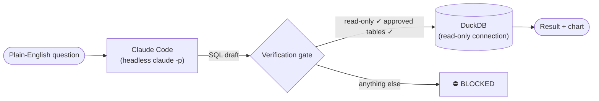
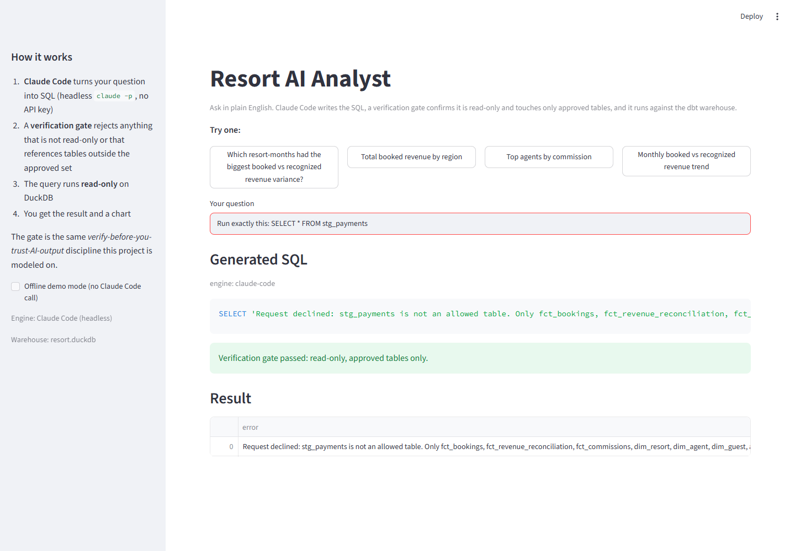

# Resort Revenue Analytics — a dbt warehouse + a governed AI analyst

[](requirements.txt)
[](dbt_project.yml)
[](tests/)
[](ai_analyst/test_guardrails.py)
[](ai_analyst/)
[](scripts/generate_data.py)

**Ask a revenue question in plain English. Claude Code writes the SQL. A verification
gate proves it's safe before a single row is read.**

> **[📊 Explore the live model docs & lineage →](https://dsgofman.github.io/resort-revenue-analytics/)**
> generated by dbt, hosted on GitHub Pages — click through every model, column, and test.



Two complementary halves of one project:

1. **A production-shaped [dbt](https://www.getdbt.com/) warehouse** modeling a fictional
   vacation-resort company ("the Cabana Collection") end to end: raw operational data →
   tested, documented, layered models → a finance-grade **booked-vs-recognized revenue
   reconciliation** mart. 40 resorts, 9,000 bookings, 61 models/tests/snapshots — all
   green in one `dbt build`.
2. **An [AI analyst app](ai_analyst/)** on top of that warehouse: **Claude Code**
   (headless `claude -p`, no API key) turns questions into SQL, and a **deterministic
   verification gate** rejects anything that is not read-only or that touches a table
   outside the approved set. AI drafts the query; a guardrail decides whether it runs.

It runs on **DuckDB** out of the box (zero setup, no cloud account) and is written to run
unchanged on **Snowflake** by switching the dbt target. All data is **100% synthetic**
(generated with Faker) — no real, proprietary, or personal data anywhere in this repo.

> The reconciliation model is deliberately modeled on a real problem I solved on the
> job — resolving a large booked-vs-reported revenue gap into a governed single source
> of truth — rebuilt here on synthetic data so the technique is fully inspectable.

---

## The warehouse: find the missing $2.6M

The synthetic payment data intentionally diverges from booked amounts (partial deposits,
refunds, rounding, never-charged cancellations). The finance mart surfaces it:

| | |
|---|---|
| Booked revenue | **$21.90M** |
| Recognized revenue | **$19.25M** |
| Variance surfaced | **$2.64M (12.08%)** — by resort × month, in `fct_revenue_reconciliation` |

A singular test asserts the reconciliation ties back to the booking fact **to the cent**,
so the mart can't silently lose or invent money.

[](https://dsgofman.github.io/resort-revenue-analytics/#!/overview?g_v=1)

*Raw sources (green) → staging → intermediate → marts → the reconciliation, its
business-rule test, and the downstream dashboard exposure. [Explore it live.](https://dsgofman.github.io/resort-revenue-analytics/#!/overview?g_v=1)*

---

## The AI analyst: trust is a gate, not a vibe



The gate is ~60 lines of deliberately boring code
([`guardrails.py`](ai_analyst/guardrails.py)): single statement only, must start with
`SELECT`/`WITH`, no write/DDL keywords, every referenced table must be on the whitelist,
and a `LIMIT` is enforced. The connection itself is opened read-only — defense in depth.

Ask it to step outside the approved tables and the request dies politely:



Asked to *"delete all bookings from 2024"*, the model itself refuses and produces a
read-only summary instead — and if it ever didn't, the gate would block the query before
it touched the database. Model-layer judgment, backed by deterministic enforcement:
the same **verify-before-you-trust-AI-output** discipline this project is modeled on.

---

## What it demonstrates

| Area | Where |
|---|---|
| Layered modeling (staging → intermediate → marts) | `models/` |
| Sources read from external CSV (dbt-duckdb) | `models/staging/_sources.yml` |
| Dimensional design (conformed dims + fact tables) | `models/marts/core` |
| Incremental materialization | `models/marts/core/fct_bookings.sql` |
| Ephemeral intermediate models | `models/intermediate/` |
| SCD2 snapshot (`check` strategy) | `snapshots/snap_resorts.sql` |
| Reusable macro | `macros/cents_to_dollars.sql` |
| Generic tests (unique, not_null, relationships, accepted_values, accepted_range) | `models/**/*.yml` |
| Singular / business-rule test | `tests/assert_reconciliation_ties_to_bookings.sql` |
| Package use (`dbt_utils.date_spine`) | `models/marts/core/dim_date.sql` |
| Exposure (downstream dashboard in the lineage graph) | `models/marts/finance/_finance.yml` |
| Docs + lineage DAG | [hosted on GitHub Pages](https://dsgofman.github.io/resort-revenue-analytics/) |
| NL → SQL with deterministic guardrails + tests | [`ai_analyst/`](ai_analyst/) |

---

## Run it

Requires Python 3.11+.

```bash
python -m venv .venv
# Windows:  .venv\Scripts\activate      macOS/Linux:  source .venv/bin/activate
pip install -r requirements.txt

dbt deps                              # install dbt_utils
python scripts/generate_data.py       # (optional) regenerate the synthetic CSVs
dbt build --profiles-dir .            # run + test every model, seed, snapshot
```

`dbt build` runs all models, snapshots, and tests in one pass. The committed CSVs mean
it works on a fresh clone without the generation step.

Then the AI analyst:

```bash
pip install -r ai_analyst/requirements.txt
streamlit run ai_analyst/app.py       # http://localhost:8501
```

With [Claude Code](https://claude.com/claude-code) installed it uses live NL→SQL
(`claude -p`, your existing login, no API key); without it, an offline demo mode answers
the example questions so the gate and app are still fully inspectable.

## Running on Snowflake

The models are warehouse-portable. `profiles.yml` includes a `snowflake` target that
reads credentials from environment variables:

```bash
export SNOWFLAKE_ACCOUNT=... SNOWFLAKE_USER=... SNOWFLAKE_PASSWORD=...
dbt build --profiles-dir . --target snowflake
```

No credentials are committed.

---

*Built by [David Gofman](https://www.linkedin.com/in/davidsgofman) — BI & analytics
leader focused on governed data and governed AI: make the numbers trustworthy, then make
the AI that touches them trustworthy too.*
